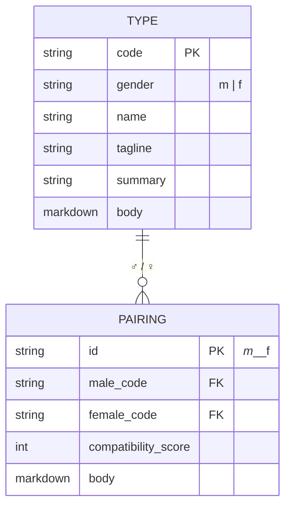
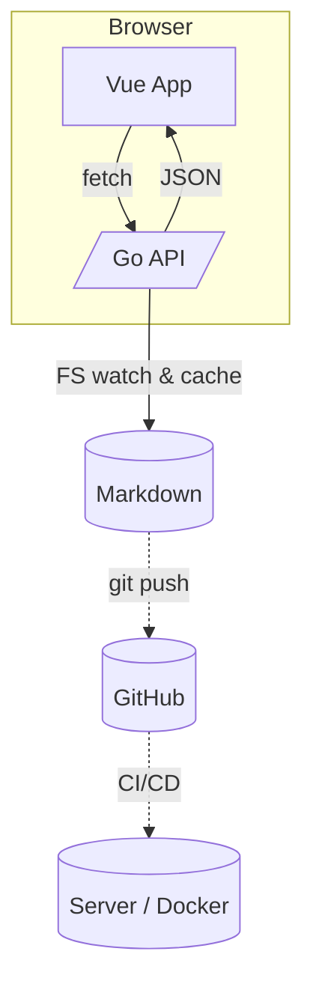

# MBTI-Site 规划设计文档
> v0.1 – 2025-06-20

---

## 0. TL;DR
• 用 *Markdown + Front-matter* 做**内容源**；脚本自动 scaffold
• 后端 **Go (Gin)**：读取 Markdown → 解析 → 缓存 → JSON API
• 前端 **Vite + Vue 3 + TypeScript + TailwindCSS**：
  – 「探索式」交互（节点地图 / 关系图 / 逐层钻取）
  – 支持 i18n（vue-i18n），首发中文
• Mono-repo（当前结构已基本可用）+ GitHub Actions CI/CD
• Roadmap 分三阶段：MVP → Explorer → 社区化 / 生态

---

## 1. 产品愿景 & 目标

| 维度 | 目标 |
| ---- | ---- |
| **使命** | 让用户 _“玩”_ MBTI：直观探索 16 人格 男女各32种本身，与 256 两两性别配对 |
| **核心体验** | 像逛地图 / 图鉴一样，从「人格宇宙」中逐步发现内容 |
| **用户价值** | 自我认知、恋爱/沟通参考、兴趣社群讨论 |
| **商业化（可选）** | 会员解锁深度报告、定制咨询、UGC & Ads |

---

## 2. 需求概览

### 2.1 功能列表（按优先级）
1. **类型索引页**
   - 16 种人格卡片（性别切换）
   - 搜索 / 筛选（理性 vs 感性…）
2. **类型详情**
   - 基本信息（front-matter）
   - 深度画像、盲点、成长建议（正文）
3. **配对探索**
   - 网格/关系图，支持拖拽选择组合
   - 配对详情页（compatibility_score & 文本）
4. **探索模式**
   - 入口：“随机抽卡 / 潜力配对 / 今日灵感”
   - 自动导航到对应详情
5. **语言切换（zh / en）**
6. （阶段二）用户测试问卷 → 推荐人格
7. （阶段三）UGC 评论 / 点赞

### 2.2 非功能需求
- **性能**：前端 LCP < 2.5 s；API < 100 ms（内网缓存）
- **SEO**：静态预渲染 + SSR（待阶段二引入 Vite SSR 或 Nitro）
- **可维护性**：内容与代码解耦，Markdown 即内容单一真源
- **多语言**：Front-matter `lang` 字段，URL 形如 `/zh/types/intj-m`
- **安全**：只读内容；未来写接口需 JWT / CSRF

---

## 3. 信息架构 & 内容模型



• **物理存储**：`content/<lang>/types/*.md` 与 `.../pairings/*.md`（已存在）
• **解析后 JSON**（示例）

```jsonc
{
  "code": "INTJ",
  "gender": "m",
  "name": "建筑师",
  "tagline": "深谋远虑…",
  "summary": "≤50 字概述",
  "body": "<html-rendered-markdown>",
  "lang": "zh"
}
```

---

## 4. 技术架构



### 4.1 后端（Go + Gin）
| 模块 | 说明 |
| ---- | ---- |
| `cmd/server` | 入口，读取 flag/env，启动 Gin |
| `pkg/content` | FS 读取，`goldmark` 解析 Markdown，出 HTML+meta |
| `pkg/cache` | 内存 LRU + ETag；监听 `fsnotify` 实时热更 |
| `pkg/api` | `/api/v1/...` 路由，返回 JSON |
| `pkg/i18n` | URL 前缀识别，多语言 fallback |
| `pkg/search` (可选) | 基于 Bleve 简易全文索引 |

#### API 草案
| Method | Path | 描述 |
| ------ | ---- | ---- |
| GET | `/api/v1/:lang/types` | 列表，支持 `?gender=m&search=intj` |
| GET | `/api/v1/:lang/types/:code-:gender` | 单条 |
| GET | `/api/v1/:lang/pairings` | 分页列表，支持 `male=intj&female=infp` |
| GET | `/api/v1/:lang/pairings/:male-:female` | 配对详情 |

### 4.2 前端（Vue 3）
| 目录 | 说明 |
| ---- | ---- |
| `src/router` | vue-router 4，路径含语言前缀 |
| `src/stores` | Pinia 管理全局状态（语言、缓存） |
| `src/components/ui/*` | Tailwind + HeadlessUI 通用组件 |
| `src/pages/*` | 路由页（Home/TypeDetail/PairingDetail/Explorer） |
| `src/i18n/*` | vue-i18n 词条，动态加载 |
| `src/composables/useContent.ts` | 请求与缓存 hooks |
| `src/visuals/Graph.vue` | D3 / Vis.js，实现探索式关系图 |

---

## 5. 交互设计 – “探索式”体验

1. **宇宙图 (Explorer)**
   - 核心：16 节点环形 or 力导布局；颜色 = 四种气质
   - 点击节点 → 展开两层：同性别 / 异性别 / 高分配对
2. **配对网格 (Matrix)**
   - 16×16 矩阵，热力图展示 compatibility_score
   - Hover 显示评分，点击跳转详情
3. **卡片翻转**
   - 在任意列表中点击可翻面预览（Tailwind transition）
4. **随机抽卡**
   - `/random` API 返回随机类型或配对
   - Banner：「今日人格 · INTJ♀」「今日配对 · ENTP♂ × ISFJ♀」
5. **移动端适配**
   - 使用 Tailwind `grid`/`flex` + `@media`；Explorer 图自动缩放
6. **浅色 / 深色**
   - Tailwind `dark:` 方案；根据系统或按钮切换

---

## 6. 多语言策略

| 层级 | 做法 |
| ---- | ---- |
| **内容** | 同一文件夹结构，不同 `lang` 前缀 (`content/en/...`) |
| **路由** | `/zh/...`、`/en/...`；router.beforeEach 设置 `locale` |
| **UI 词条** | vue-i18n JSON；默认 `zh` |
| **SEO** | `<link rel="alternate" hreflang="en" …>` |
| **扩展** | 第三语言仅需添加 Markdown + 词条 |

---

## 7. DevOps / 部署

| 阶段 | 方案 |
| ---- | ---- |
| **CI** | GitHub Actions：`on: push` → `go test`, `npm run build` |
| **镜像** | 多阶段 Docker：`golang:alpine` 编译 → `nginx:alpine` 静态文件；或用 **单容器** (Go 直接静态+API) |
| **CD** | Actions Deploy → Docker Registry → K8s / Fly.io / Railway |
| **监控** | Prometheus + Grafana / 健康检查 `/ping` |

---

## 8. 路线图

| 阶段 | 里程碑 | 目标日期 |
| ---- | ---- | ---- |
| **MVP** | 后端 API + 类型/配对详情页 + 基础列表 | T+4 周 |
| **Explorer** | Graph UI、随机抽卡、深色模式 | T+8 周 |
| **Growth** | 问卷荐型、UGC 评论、账号体系 | T+16 周 |
| **Ecosystem** | 插件 SDK / 公开 API / 社区运营 | T+24 周 |

---

## 9. 开发任务拆分（Sprint 0）

- [ ] 后端
  - [ ] 解析器：front-matter + markdown→HTML
  - [ ] 缓存层 (fsnotify)
  - [ ] `/types` & `/pairings` API
- [ ] 前端
  - [ ] 基础路由 & 页面骨架
  - [ ] Pinia + fetch hook
  - [ ] TypeCard / PairCard 组件
- [ ] DevOps
  - [ ] GitHub Actions Lint/Test
  - [ ] Dockerfile
- [ ] 文档
  - [ ] README 更新：启动脚本、一键本地运行

---

## 10. 未来可选议题

1. **SSR / Edge Rendering**：Nuxt 3 ‑> Dynamic routes, Vite SSR, Cloudflare Pages Functions
2. **搜索/推荐**：embedding + 向量检索（Weaviate）→ 相似人格 / 配对
3. **AI 生成**：GPT 自动补全 Markdown 的 `summary` 字段
4. **Gamification**：成就徽章、成长曲线
5. **Mobile App**：Ionic / Capacitor 封装 PWA

---

### 附录 A. API OpenAPI 摘要

```yaml
openapi: 3.1.0
info:
  title: MBTI Explorer API
  version: 0.1.0
paths:
  /api/v1/{lang}/types:
    get:
      parameters:
        - in: path
          name: lang
          schema: { type: string, enum: [zh, en] }
        - in: query
          name: gender
          schema: { type: string, enum: [m, f] }
        - in: query
          name: search
          schema: { type: string }
      responses:
        '200':
          description: OK
  /api/v1/{lang}/types/{code}-{gender}:
    get: { … }
  /api/v1/{lang}/pairings:
    get: { … }
  /api/v1/{lang}/pairings/{male}-{female}:
    get: { … }
```

---

> **备注**：本设计文档可作为 PR 审阅的起点，后续迭代请保持 Changelog。
```